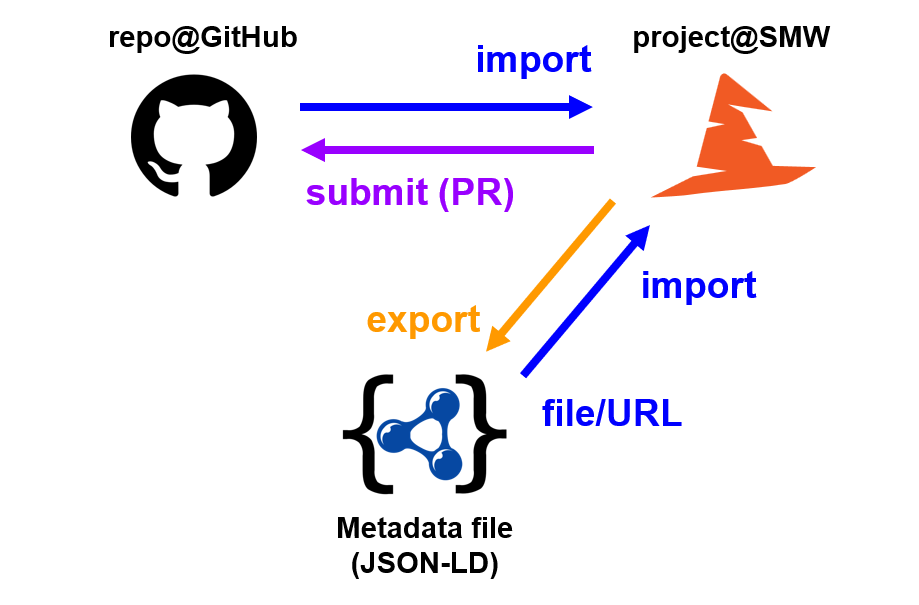

# Abstract

This report provides an overview of our activities and accomplishments concerning machine-actionable Software Management Plans (SMPs) and the Software Management Wizard (SMW) during the ELIXIR BioHackathon Europe 2023. ELIXIR acknowledges the critical role of effective software management in facilitating sustainable and reproducible research outcomes. The Software Best Practices group is actively committed to establishing a robust framework for SMP creation. In this project, our primary focus is on streamlining the SMP creation process for research software within ELIXIR. To achieve this, we are working on developing essential integrators and identifying and reviewing the relevant metadata schema. This effort is closely aligned with various related initiatives such as [OpenEBench][openebench], [FAIR4RS][fair4rs], [RDA][rda], [maSMPs][masmp], among others. The outcomes of the BioHackathon project are now available for immediate use and can be further refined in the future based on community feedback and advancements in research software best practices.

# Introduction

In recent years, the management of research software has garnered increasing attention across various domains, motivated in part by concerns about the reproducibility of scientific results [@baker_2016,@stodden_2016]. This heightened interest has given rise to a myriad of approaches and services aimed at addressing the unique challenges of this crucial aspect of scientific research. Notable developments in this landscape include initiatives like [Codemeta][codemeta] [@jones_codemeta_2016], [Software Heritage][soft-heritage], the introduction of [machine-actionable Software Management Plans (maSMPs)][masmp] [@masmpOntology], and the proliferation of best practices and templates within research infrastructures and [libraries][nyu-soft-repro]. Due to the significance of this topic, some countries have established guides and practices at [a national level][nwo-soft-plan].

ELIXIR has recognized the importance of proper software management and the adoption of SMPs to facilitate reproducibility and sustainability in research. To further these objectives, ELIXIR established its Software Best Practices group, which has been diligently working on creating an SMP template. This template serves as a foundation for structuring software management plans and streamlining the process of their creation. A significant milestone in this endeavor was the encoding of this SMP template as a knowledge model within the [Data Stewardship Wizard (DSW)][ds-wizard] platform [@dswPaper]. This transformation resulted in the creation of the Software Management Wizard (SMW), a user-friendly tool that empowers the research community to readily engage with SMPs and enhance their software management practices.

This project builds upon these foundations, addressing both content and technical aspects. It assists the process of refining the SMP template by improving its structure, questions, and machine-actionability. Additionally, the project aims to align the template with pertinent ontologies and metadata schemas to ensure seamless interoperability and adherence to recognized standards. Simultaneously, the technical aspects of efficiently composing and utilizing SMPs are being enhanced, further bolstering the capabilities of the research community in their software management endeavors. Through these combined efforts, this project seeks to foster greater transparency, reproducibility, and efficiency in research software management within the ELIXIR community and beyond.

# ELIXIR SMPs, maSMPs, and SMW

The ELIXIR Software Best Practices group (under the [Tools Platform][elixir-tools-platform]) aims to improve the quality and sustainability of Life Science research software. One of the goals is to consolidate software management planning, provide relevant training/guidance, and other means to enable adoption of software development best practices. Over the years, the group developed a template for SMPs which has been later on turned into a knowledge model for DSW, resulting in the Software Management Wizard (SMW). Drawing inspiration from other efforts and working towards a better integration and interoperability between different platforms, the group has been prioritizing machine-actionable SMPs.

## Existing Mapping

In prior workshops, the knowledge model (KM) and its associated queries were meticulously aligned with various ontologies, including ELIXIR SMP [@elixirSMP], [RDMO SMP][rdmo-smp], maSMP Ontology [@masmpOntology], Bioschemas ([Computational Tool Profile][comptool-bschema]), and [CodeMeta][codemeta]. This mapping process involved linking 30 KM questions to specific properties, predominantly drawing from the groundwork laid by ELIXIR SMP [@elixirSMP]. For instance, it revealed that the property `discussionURL` could aptly address the question *Do you state how to report bugs and/or usability problems by the software user/s?*.

Building upon this foundational mapping, an expanded effort was undertaken to map all KM questions and explore potential machine-actionable representations of corresponding responses. In this endeavor, 56 KM questions were scrutinized, leading to the identification of 47 properties sourced from [schema.org][schema], [bioschemas.org][bioschemas], maSMP Ontology [@masmpOntology], and [NCI Thesaurus (NCIt)][ncit]. This comprehensive mapping initiative marks a significant stride towards enhancing the interoperability and semantic richness of the KM.

## Aligning Knowledge Model

During the reevaluation of the mapping process, the knowledge model underwent iterative refinement through collaborative discussions within a broader group. Notably, improvements were made to the formulation of certain questions, exemplified by the adoption of a *list question* structure, as opposed to a single-field of items separated with commas. This decision has led to a design that is more user-friendly and versatile, while also reducing the likelihood of input errors.

The collaborative discussions also served as a platform for addressing additional issues that emerged, sparking further enhancements to the knowledge model. An instance of such refinement involved diversifying the available versioning schemes.

The collaborative discussions also served as a platform to address other issues, which led to further improvements in the knowledge model. One specific improvement was the expansion of choices for versioning schemes. Initially, the questions exclusively favoured [Semantic Versioning (SemVer)][semver], overlooking alternative and often more fitting schemes such as [Calendar Versioning (CalVer)][calver]. This realization prompted a broader consideration of versioning practices, enriching the knowledge model's adaptability to diverse development scenarios and preferences.

## Suggestions for maSMPs

Despite the substantial updates made to the knowledge model during the BioHackathon, there remain several crucial steps yet to be taken for the continuous enhancement of maSMPs. Notably, the following suggestions have been identified as key areas for improvement:

1. **Alignment with CodeMeta**: A priority lies in aligning maSMPs more closely with [CodeMeta][codemeta], a widely adopted standard for machine-readable (research) software metadata. This alignment ensures a seamless integration of maSMPs into the broader ecosystem of machine-readable software metadata, avoiding a proliferation of different formats and fostering interoperability and standardized representation.

2. **Contributor Alignment with CITATION.cff**: To streamline the contribution process, aligning maSMPs with [CITATION.cff][cff] is recommended. Given the widespread usage of CITATION.cff, this alignment facilitates a more standardized and widely accepted approach to acknowledging contributors, thus enhancing the overall transparency and attribution of contributions.

3. **Enhancement of Questions and Machine-Actionability**: A targeted effort should be directed towards improving the questions within maSMPs, particularly in areas such as documentation, versioning, requirements, and dependencies. This involves refining the machine-actionability of these aspects to ensure that responses can be effectively processed and utilized in automated workflows, promoting a more efficient and reliable exchange of software-related information.

By addressing these areas, maSMPs can further solidify their utility, align with established standards, and contribute to a more seamless integration within the broader landscape of machine-readable software metadata. These steps will not only enhance the comprehensiveness of the knowledge model but also promote its broader adoption and usability in diverse research and software development contexts.

SMPs are similar to Data Management Plans (DMPs) as they aim at facilitating the management of research- and software-related aspects corresponding to the software lifecycle. They do not intend replace software project management but complement it. In recent years, this topic has gained more attention as research software is more and more recognized by the research community as a research output and critical to research reproducibility. For instance, the Software Best Practices Focus Group, part of the ELIXIR Tools Platform, proposed an SMP [@elixirSMP] mainly targeting researchers who develop software. Although directed at Life Science researchers, thanks to its domain-agnostic approach, it could also be used by researchers in other domains and by Research Software Engineers. The Netherlands *eScience Center* and the *Max Plank Digital Library* (MPDL) also provide domain-agnostic SMPs that include maturity-like software levels so researchers can decide which one applies to their project [@martinez-ortiz_practical_2022,@grossmann_sustainable_2023].

maSMPs aim at providing a machine-actionable layer on top of SMPs enriched with semantically structured metadata. A maSMP metadata schema, based on schema.org, was created from the ELIXIR SMPs [@masmpOntology,@giraldo_metadata_2023] and later aligned to the eScience and MPDL ones [@giraldo_workshop_2023,@castro_five_2023]. While the initial versions of the maSMP metadata schema focused on the software elements (i.e, software source code and software releases), the [latest version 2.1.0][masmp210] also includes the actual management plan and the option to link questions to expected metadata that should be present by the end of the project.

# SM Wizard Enhancements

The technical aspect of our project focused on providing a way to use an existing maSMP to (pre)fill a questionnaire in SMW and also vice versa, to generate a maSMP from an existing questionnaire and publish it, e.g. in a GitHub repository - adding it to the research software project. In order to do this, we used the mapping between the ontology and the SMP knowledge model to create an SMP Importer and SMP Document Template (exporter). For the publishing of an SMP, a submission service was also developed.

## SMP Importer

DSW offers so-called *project importers*, a configured external service that opens as a pop-up child window from a questionnaire. The window can be customized to request relevant information through a form or upload a file. The service then retrieves basic information about the project using the information provided. Finally a set of replies are returned to the questionnaire closing the window. In technical view, it is implemented through the [DSW Importer SDK][dsw-importer], a JavaScript library; however, the service can also have its own backend and further integrations. In this way, it provides high level of flexibility to obtain multiple replies from basically any source to DSW.

We developed such an importer for maSMPs in RDF, more specifically in JSON-LD. Once the importer window opens, the user can provide maSMP in three ways:

- upload a file directly,
- provide a URL to the file,
- fill owner, repo name, and file path in case of public GitHub repository.

After choosing the course of action, the file is loaded and processed on the backend (in Python, via AJAX), and a set of replies is sent back to the questionnaire in SMW where the user can review what is being imported and accept it or reject it. The backend has two main tasks. First, it gets the RDF/JSON-LD contents from the desired resource (e.g. from file, downloads from URL, or tries to fetch from GitHub via API). Second, it encodes the mapping and translates from RDF/JSON-LD to questionnaire replies; more specifically to instructions that should be pushed back to SMW. When this is done, the result is returned to the frontend/JavaScript which sends it back through the SDK to SMW (and closes the importer window).

The SMP Importer is publicly available on GitHub under the Apache-2.0 license and is ready for use. It's implementation also allows for an expansion of in terms of mapping (change of SMP questions, new information in SMPs, etc.) as well as supported ways on how to retrieve maSMPs or their supported formats.

## SMP Document Template

In order to update the research software metadata in a GitHub repository, it is necessary to convert the questionnaire back into the format compatible with SMP Importer. The DSW provides a solution through the creation of a Document Template that covers the mapping process. Technically, the Document Template is implemented as a Jinja template. The DSW provides to the Document Template a context containing the Knowledge Model, questionnaire, and questionnaire responses.

Users are granted the flexibility to choose their preferred output format (such as HTML, JSON, RDF, etc.), and they can define the specific structure of the Document Template using Jinja. Subsequently, DSW utilizes this Document Template to generate the appropriate document, tailored to the chosen format.

We developed such [a document template][smp-template] for research software metadata. This template generates a JSON-LD output that can be placed to the GitHub Repository. It's important to note that the current version of the document template only encompasses a portion of the Knowledge Model, specifically Chapter 1 and Chapter 6. This is because the mapping process for the remaining parts of the Knowledge Model is still ongoing. Our future efforts will be directed towards completing the mapping for the entire Knowledge Model.

The SMP Document Template is accessible to the public [via GitHub][smp-template] and is governed by the Apache-2.0 license. It is readily available for immediate use and can also be expanded upon in the future. It offers flexibility for modifications, such as altering SMP questions or incorporating new information into SMPs.

## GitHub Submission Service

To complete the "loop" for updating research software metadata in a GitHub repository through SMW, we developed a *submission service*. Such services in DSW allow to accept a submitted document, process it in any way, and eventually return a relevant URL back to DSW. The goal was to enable maSMP created with the previously described document template to be added to a GitHub repository through a Pull Request (PR).

For the service to work and be able to create PRs, we created a [`sm-wizard-bot`][sm-wizard-bot] account on GitHub that is responsible for creating forks and PRs through its API (authenticated using an access token). We had to deal with various potential obstacles such as asynchronnous creation of forks via GitHub API and the possible need or existence of multiple forks of the same original repository. The achieved flow with the service works as follows:

1. User generates a maSMP document in DSW.
2. User submits the (JSON-LD) document in DSW (clicks a Submit button and selects the configured service).
3. Service accepts the (JSON-LD) document and verifies the request.
4. Service extracts the GitHub repository URLs (if not present, it reports an error).
5. Service creates a fork via GitHub API (but with a name that contains also a timestamp) and then waits until the fork is created (may take several seconds, up to minutes for larger repositories).
6. Service creates (or updates) the `metadata.json` JSON-LD file in the repository and commits the changes via GitHub API.
7. Service submits a PR to the original repository with title and message informing that it is an update submitted from SMW.
8. User gets back the URL of the PR in GitHub and it is stored next to the document in SMW.

This service has been successfully tested in both create and update use cases. There is no need to encode the mapping in the service as this is already handled by the document template. The only requirement from the incoming JSON-LD file is the presence of a triple with `schema:codeRepository` property. Then, it tests whether the URL is actually a GitHub.com repository. It works with public repositories but can also work with private if the `sm-wizard-bot` is granted access.

As for possible future enhancements, the service can be extended to support platforms other than GitHub.com (e.g. GitLab or BitBucket, but also GitHub Enterprise or self-hosted GitLab EE). A more versatile mechanism to handle private repositories on GitHub can also be implemented. This will require users to allow the app to integrate with their repository. Finally, a cleanup mechanism to remove forks for closed or old PRs might be needed in the future.

# Conclusions and Future Steps

In conclusion, the collaborative work carried out during BioHackathon Europe 2023 has led to significant progress in the development of machine-actionable SMPs, not only within the ELIXIR framework but also extending their applicability beyond. The efforts put forward during the event have resulted in a robust technical solution for seamlessly integrating SMPs with existing research software projects, marking a significant stride towards practical implementation.

Furthermore, the BioHackathon served as a catalyst for the ongoing development of SMPs. The improvements made during the event lay a solid foundation for their continuous enhancement and refinement, ensuring their relevance and effectiveness in addressing the evolving needs of the scientific and research community.

In the future, it's important to make sure that SMPs are aligned with commonly used metadata standards for research software projects. This alignment is seen as a crucial step towards making SMPs work well together, be more standardized, and accepted by the wider research community. The collaborative and technical solutions that came out of BioHackathon Europe 2023 give us hope for the continued improvement and meaningful integration of SMPs, which will have a big impact on research software practices.

# Acknowledgements

This work was done during the [BioHackathon Europe][biohackeurope] 2023 organized by ELIXIR in October/November 2023. We thank the organizers and fellow participants. The development and operation of DSW are supported by ELIXIR CZ research infrastructure (MEYS Grant No. LM2023055).

# References

[biohack-europe]: https://biohackathon-europe.org
[bioschemas]: https://bioschemas.org
[calver]: https://calver.org
[cff]: https://citation-file-format.github.io
[codemeta]: https://codemeta.github.io
[comptool-bschema]: https://bioschemas.org/profiles/ComputationalTool/1.0-RELEASE
[ds-wizard]: https://ds-wizard.org
[dsw-importer]: https://github.com/ds-wizard/dsw-importer-sdk
[elixir-tools-platform]: https://elixir-europe.org/platforms/tools
[fair4rs]: https://www.rd-alliance.org/node/69317/outputs
[masmp210]: https://discovery.biothings.io/ns/maSMP
[masmp]: https://zbmed-semtec.github.io/maSMPs/
[ncit]: https://ncit.nci.nih.gov/ncitbrowser/
[nyu-soft-repro]: https://guides.nyu.edu/software-reproducibility
[nwo-soft-plan]: https://www.nwo.nl/en/news/national-guide-research-software-management
[openebench]: https://openebench.bsc.es
[rda]: https://www.rd-alliance.org
[rdmo-smp]: https://rdm.mpdl.mpg.de/2022/12/09/smp-template-available/
[schema]: https://schema.org
[semver]: https://semver.org
[sm-wizard-bot]: https://github.com/sm-wizard-bot
[smp-template]: https://github.com/ds-wizard/masmp-template
[soft-heritage]: https://www.softwareheritage.org
