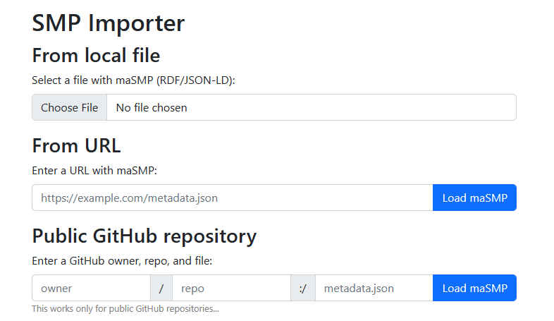
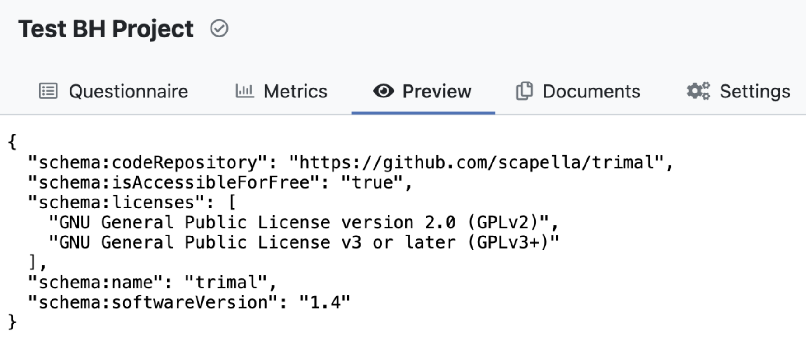
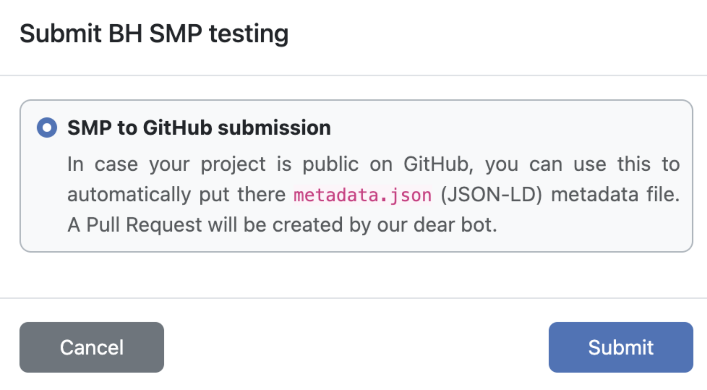
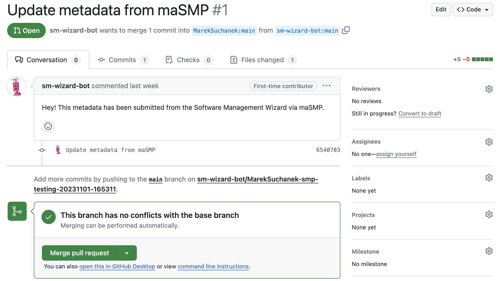
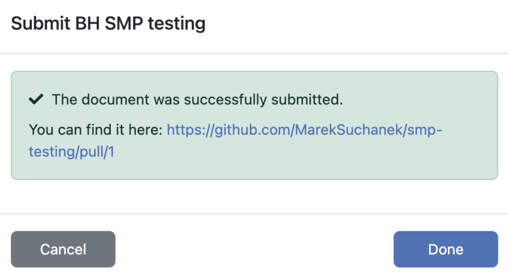

# Abstract

This report provides an overview of our activities and accomplishments concerning machine-actionable Software Management Plans (SMPs) and the Software Management Wizard (SMW) during the ELIXIR BioHackathon Europe 2023. ELIXIR acknowledges the critical role of effective software management in facilitating sustainable and reproducible research outcomes. The Software Best Practices group is actively committed to establishing a robust framework for SMP creation. In this project, our primary focus is on streamlining the SMP creation process for research software within ELIXIR. To achieve this, we are working on developing essential integrators and identifying and reviewing the relevant metadata schema. This effort is closely aligned with various related initiatives such as OpenEBench, FAIR4RS, RDA, maSMPs, among others. The outcomes of the BioHackathon project are now available for immediate use and can be further refined in the future based on community feedback and advancements in research software best practices.

# Introduction

In recent years, the management of research software has garnered increasing attention across various domains. This heightened interest has given rise to a myriad of approaches and services aimed at addressing the unique challenges of this crucial aspect of scientific research. Notable developments in this landscape include initiatives like Codemeta, Software Heritage, the introduction of machine-actionable Software Management Plans (SMPs), and the proliferation of best practices and templates within research infrastructures.

ELIXIR has recognized the importance of proper software management and the adoption of SMPs to facilitate reproducibility and sustainability in research. To further these objectives, ELIXIR established its Software Best Practices group, which has been diligently working on creating an SMP template. This template serves as a foundation for structuring software management plans and streamlining the process of their creation. A significant milestone in this endeavor was the encoding of this SMP template as a knowledge model within the [Data Stewardship Wizard (DSW)](https://ds-wizard.org) platform [@dswPaper]. This transformation resulted in the creation of the Software Management Wizard (SMW), a user-friendly tool that empowers the research community to readily engage with SMPs and enhance their software management practices.

This project builds upon these foundations, addressing both content and technical aspects. It involves refining the SMP template by improving its structure, questions, and machine-actionability. Additionally, the project aims to align the template with pertinent ontologies and metadata schemas to ensure seamless interoperability and adherence to recognized standards. Simultaneously, the technical aspects of efficiently composing and utilizing SMPs are being enhanced, further bolstering the capabilities of the research community in their software management endeavors. Through these combined efforts, this project seeks to foster greater transparency, reproducibility, and efficiency in research software management within the ELIXIR community and beyond.

# ELIXIR SMPs, maSMPs, and SMW

// TODO: Eva+Renato - describe what is it about, how it works, the ontology, work done on the mapping, challenges, suggestions for the ontology

# SM Wizard Enhancements

The technical aspect of our project focused on providing a way to use an existing maSMP to (pre)fill a questionnaire in SMW and also vice versa to generate a maSMP from existing questionnaire and publish it, e.g. in a GitHub repository (attach it to the research software project). In order to do that, we used the mapping between the ontology and the SMP knowledge model to create an SMP Importer and SMP Document Template. For the publishing of an SMP, a submission service has been developed.

// TODO: Marek - figure with the inputs/outputs around SMW

## SMP Importer

DSW offers so-called *project importers*, a configured external service that opens as a pop-up child window from a questionnaire, gets basic information about the project, user can interact with the window in any way (e.g. select something, upload file, fill a form), and finally it returns back a set of replies back to the questionnaire and closes. In technical view, it is implemented through the [DSW Importer SDK](https://github.com/ds-wizard/dsw-importer-sdk), a JavaScript library; however, the service can also have its own backend and further integrations. In this way, it provides high level of flexibility in matter of getting multiple replies from basically any source to DSW.

We developed such an importer for maSMPs in RDF, more specifically in JSON-LD. Once the importer window opens, the user can provide maSMP in three ways:

- upload a file directly,
- provide a URL to the file,
- fill owner, repo name, and file path in case of public GitHub repository.

Upon the action, the file is loaded and processed on the backend (in Python, via AJAX), and a set of replies is sent back to the questionnaire in SMW where the user can review what is being imported and accept it or reject it. The backend has two main tasks. First, it gets the RDF/JSON-LD contents from the desired resource (e.g. from file, downloads from URL, or tries to fetch from GitHub via API). Second, it encodes the mapping and translated from RDF/JSON-LD to questionnaire replies; more specifically to instructions what should be pushed back to SMW. When this is done, the result is returned to the frontend/JavaScript which sends it back through the SDK to SMW (and closes the importer window).

The SMP Importer is publicly available on GitHub under Apache-2.0 license and is ready for use as well as further enhancements in the future. Here again, it can be extended in terms of mapping (change of SMP questions, new information in SMPs, etc.) as well as supported ways how to get maSMPs or their supported formats.

## SMP Document Template

// TODO: Vojtěch - what is the document template in general, how it was developed in this context, what is the result (where it is available), next steps

## GitHub Submission Service

To complete the "loop" for updating research software metadata in a GitHub repository through SMW, we developed a *submission service*. Such services in DSW allows to accept a submitted document, process it in any way, and eventually return a relevant URL back to DSW. The goal was to enable maSMP created with the previously described document template to be suggested in target GitHub repository as a Pull Request (PR).

For the service to work and be able to create PRs, we created a [`sm-wizard-bot`](https://github.com/sm-wizard-bot) account on GitHub that is the one creating forks and PRs through API (authenticated using an access token). We had to deal with various potential obstacles such as asynchronnous creation of forks via GitHub API or possibility of need of multiple forks with the same original repository name. The achieved flow with the service works as follows:

1. User generates a maSMP document in DSW.
2. User submits the (JSON-LD) document in DSW (clicks a Submit button and selects the configured service).
3. Service accepts the (JSON-LD) document and verifies the request.
4. Service extracts the GitHub repository URLs (if not present, it reports an error).
5. Service creates a fork via GitHub API (but with a name that contains also a timestamp) and then waits until the fork is being created (may take several seconds, up to minutes for larger repositories).
6. Service creates (or updates) the `metadata.json` JSON-LD file in the repository and commits the changes via GitHub API.
7. Service submits a PR to the original repository with title and message informing that it is an update submitted from SMW.
8. User gets back the URL of the PR in GitHub and it is stored next to the document in SMW.

This service has been successfully tested in both create and update use cases. There is no need to encode the mapping in the service as that is handled already in the document template. The only thing that is needed from the incoming JSON-LD file is presence of a triple with `schema:codeRepository` property. Then, it is tested whether the URL is actually a GitHub.com repository. It works with public repositories but can work also with private to which the `sm-wizard-bot` has access.

As for possible future enhancements, the service can be extended to support also other than GitHub.com repositories (e.g. GitLab or BitBucket, but also GitHub Enterprise or self-hosted GitLab EE). For GitHub, it might be better to create a different mechanism for private repositories, but that would require users to enable the app for the repository; however, the question on code repository is currently following the question whether it is a public repository. Finally, a cleanup mechanism to clean forks for closed or old PRs might be needed in the future. 

# Conclusions and Future Steps

// TODO: when all parts done

# Acknowledgements

This work was done during the [BioHackathon Europe](https://biohackathon-europe.org/) 2023 organised by ELIXIR in October/November 2023. We thank the organisers and fellow participants. The development and operation of DSW are supported by ELIXIR CZ research infrastructure (MEYS Grant No. LM2023055). 

# References
